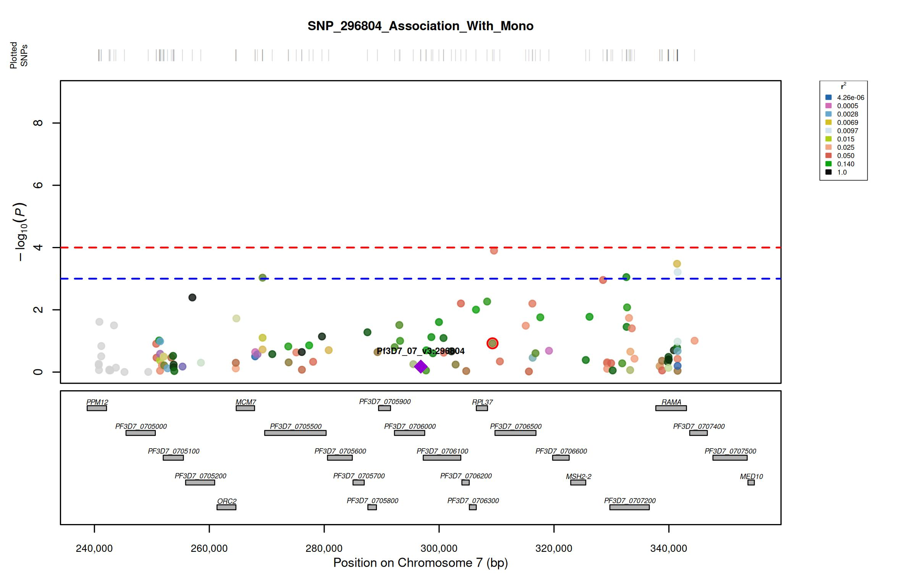

### Information Regarding a Test Run for LocusZoom Plasmodium Falciparum

LocusZoom requires 3 files:

`example.assoc.log`: A logistic association file generated from your GWAS association test, via PLINK.

`Example.genes`: A genelist generated from an annotated genome file. More information regarding *P. falciparum* annotated genome can be found at: https://www.malariagen.net/resource/34/

`testrunLD.ld`: A linkage disequillibrium measurement file generated from bed files. To generate your own, see the `README.md`.

### LD Script

Chromosome: 7

SNP: 296804

Phenotype: Monoclonal infections.

Code:

```{bash}
./plink --bfile /home/user/Plasmodium-LocusZoom/LD_Bed/bed_file --allow-extra-chr --chr Pf3D7_07_v3 --from-bp 250000 --to-bp 350000 --r2 --ld-window 100000000 --ld-window-kb 500 --ld-window-r2 0 --ld-snp Pf3D7_07_v3:296804 --keep-allele-order --out /home/user/plinker/testrunLD
```
### LocusZoom Run

```{bash}
Rscript test.R example.assoc.log testrunLD.ld Pf3D7_07_v3:296804 Example.genes Pf3D7_07_v3:309298 10000 SNP_296804_Association_With_Mono /home/user/Plasmodium-LocusZoom/Example/output.jpeg
```
### Example Run: Association of SNP 296804 with monoclonal infections.


